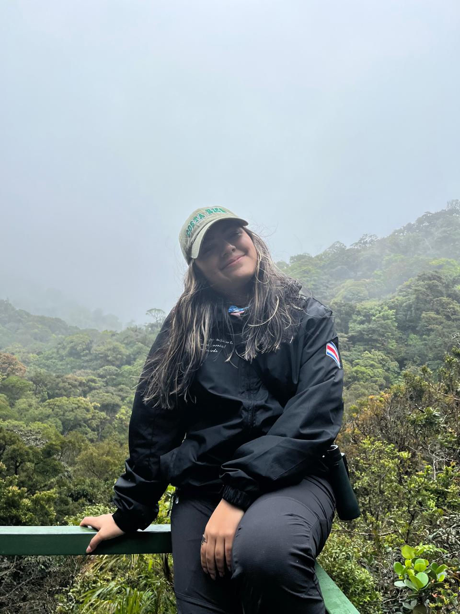

::: {.perfil-superior}

::: {.perfil-foto}

{fig-alt="Fotografía de perfil"}

:::

::: {.perfil-info}

# Aylin Rodríguez Jiménez

## Estudiante de Bachillerato en Biología Tropical 

Escuela de Ciencias Biológicas  
Universidad Nacional, Costa Rica

::: {.enlaces-perfil}

[<i class="bi bi-envelope-fill"></i> Correo](mailto:aylin.rodriguez.jimenez@est.una.ac.cr)

[<i class="bi bi-github"></i> GitHub](https://github.com/arodriguez1004)

[<i class="bi bi-person-badge-fill"></i> ORCID](https://orcid.org/0009-0002-7334-1191)

[<i class="bi bi-linkedin"></i> LinkedIn](https://linkedin.com/in/aylin-rodriguez-102953427)

:::

:::

:::

---

## Biografía

Soy estudiante de Biología Tropical en la Universidad Nacional de Costa Rica. He trabajado con mamiferos, aves, anfibios y reptiles  en conservación, monitoreo y estudio de comportamiento.Tambien he trabajado con educación ambiental y ciencia ciudadana. En la búsqueda de mis intereses, me he dado cuenta de que el estudio de comportamiento animal es realmente interesante y mi grupo favorito son los anfibios, sin embargo, estoy dispuesta  a aprender y colaborar con respecto a cualquier rama de la biología y ser participe de la búsqueda de información y la comunicación de nuevos conocimientos. 

---

## Áreas de interés

- Ecología
- Conservación
- Biogeografía
- Educación ambiental 
- Comportamiento animal 
- Herpetología 

---

## Habilidades

- R
- QGIS
- Microsoft Office
- Inglés B2
- Salud ocupacional y primeros auxilios 

---

## Formación académica

**Universidad Nacional (UNA)**

Bachillerato en Biología

*2023 – Presente*
